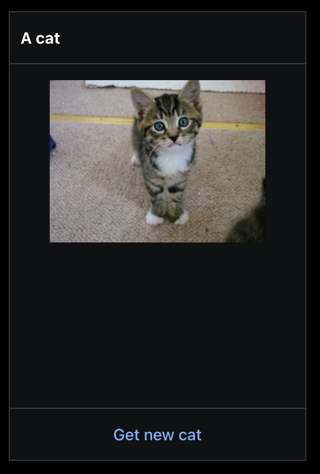

# sanity-plugin-dashboard-widget-cats

> **NOTE**
>
> This is the **Sanity Studio v3 version** of sanity-plugin-dashboard-widget-cats.
>
> For the v2 version, please refer to the [v2-branch](https://github.com/sanity-io/plugin-template-dashboard-widget-cats).

## What is it?

An example dashboard widget for [@sanity/dashboard][dashboard-plugin] that shows a random cat.

This plugin mostly exist to show how a simple widget can be made.



## Install

```
npm install --save sanity-plugin-dashboard-widget-cats@studio-v3
```

or 

```
yarn add sanity-plugin-dashboard-widget-cats@studio-v3
```

Ensure that you have followed install and usage instructions for @sanity/dashboard.

## Usage

Add it as a widget to @sanity/dashboard plugin in sanity.config.ts (or .js):

```js
import { dashboardTool } from "@sanity/dashboard";
import { catsWidget } from "sanity-plugin-dashboard-widget-cats";

export default createConfig({
  // ...
  plugins: [
     dashboardTool({
             widgets: [
                 catsWidget(),
             ],
         }
     ),
  ] 
})
```

## Configure

The widget size can be controlled using layout.width: 

```js
dashboardTool({
        widgets: [
            catsWidget({ layout: { width: "small" } }),
        ],
    }
)
```

## License

MIT-licensed. See LICENSE.


## Develop & test

This plugin uses [@sanity/plugin-kit](https://github.com/sanity-io/plugin-kit)
with default configuration for build & watch scripts.

See [Testing a plugin in Sanity Studio](https://github.com/sanity-io/plugin-kit#testing-a-plugin-in-sanity-studio)
on how to run this plugin with hotreload in the studio.

### Release new version

Run ["CI & Release" workflow](https://github.com/sanity-io/example-dashboard-widget-cats/actions/workflows/main.yml).
Make sure to select the main branch and check "Release new version".

Semantic release will only release on configured branches, so it is safe to run release on any branch.
